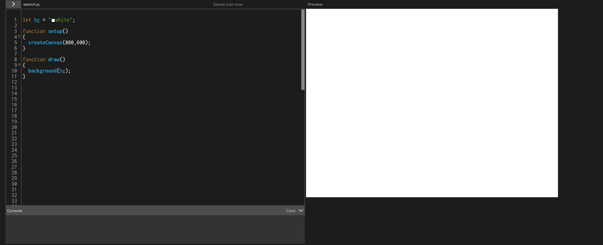
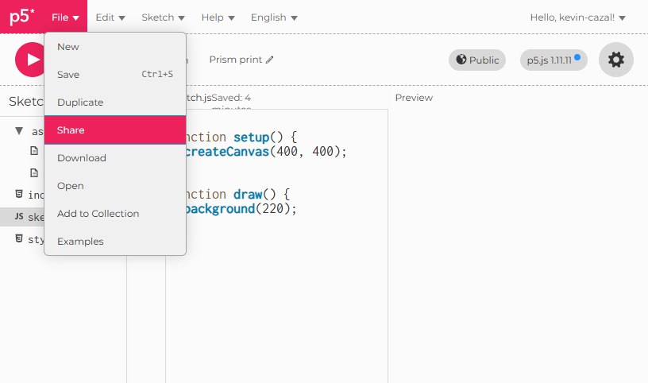
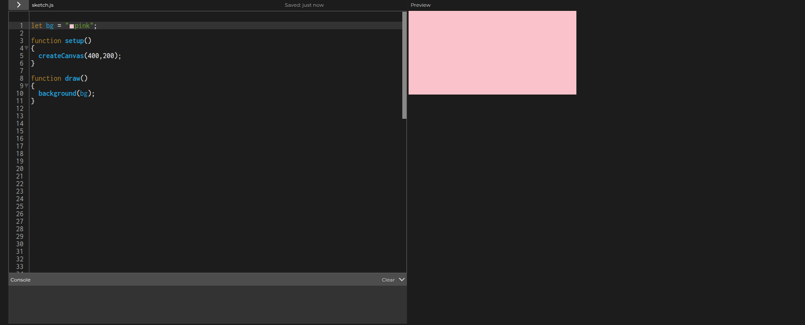
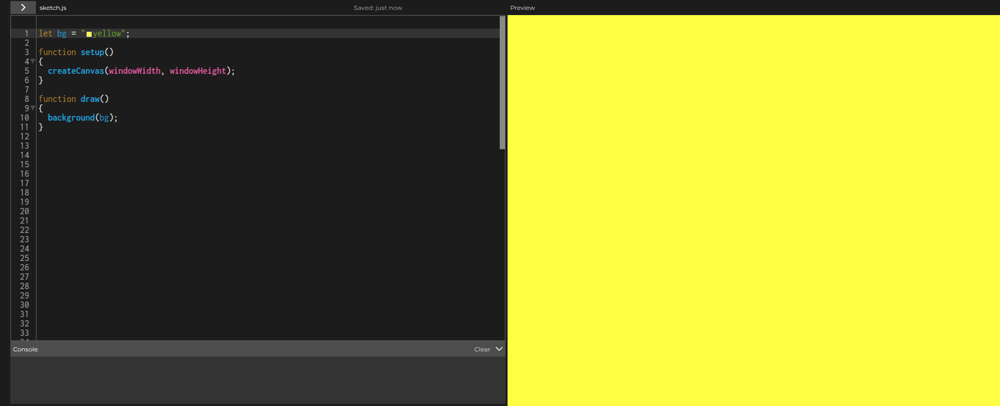
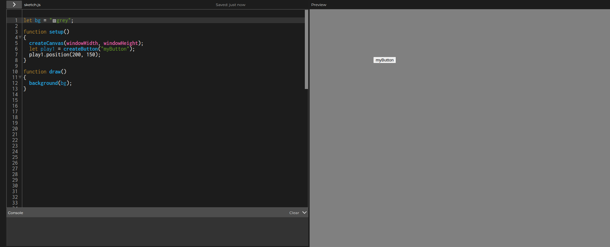
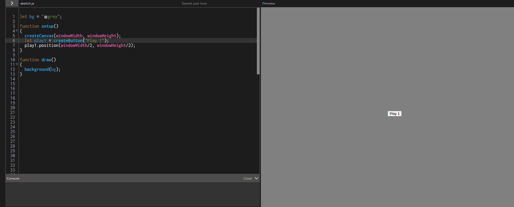
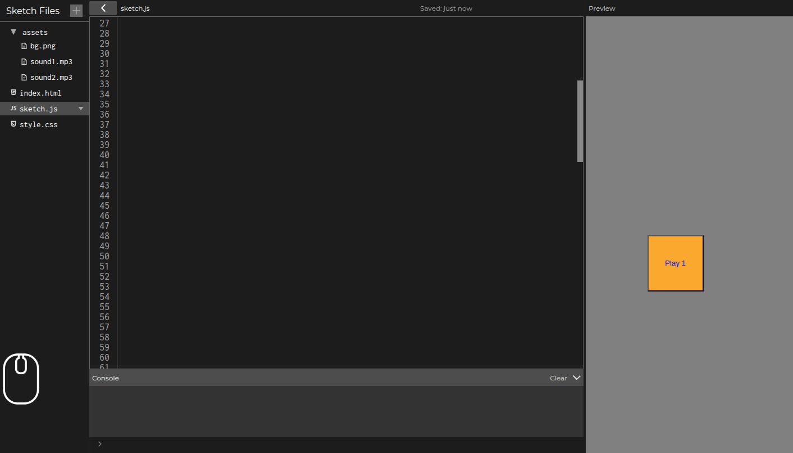
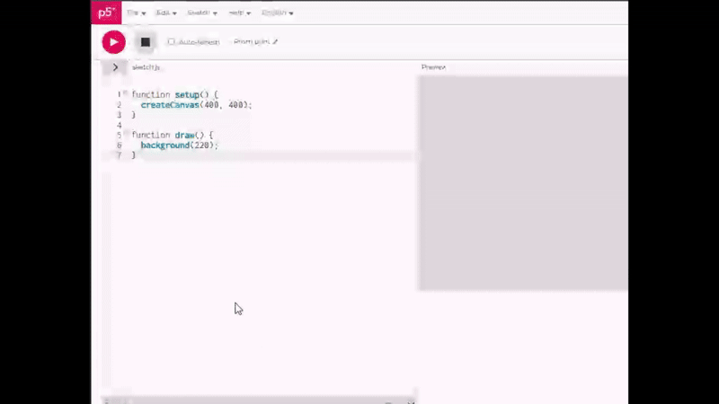

# Atelier : Premiers pas avec une Table de Mixage DJ

Bienvenue dans votre première table de mixage DJ ! Dans cet atelier, vous apprendrez les bases pour créer une application simple qui permet de jouer deux sons et de les contrôler avec des boutons. Et tout ça compatible avec vos smartphone !

---

## Introduction : Ce que nous allons construire

Vous allez créer une application simple avec :
- Un canvas (zone de dessin) pour afficher votre interface
- Deux boutons pour jouer/pause deux sons différents
- La possibilité de charger vos propres sons
- Un fond personnalisable (image ou couleur)

---

## Pour commencer : Code de base

Avant de commencer, vous avez besoin d'un point de départ. Voici le code minimal pour faire fonctionner votre projet :

```javascript
function setup()
{
    createCanvas(800, 600);
}

function draw()
{
    background("white");
}
```

Nous créons ici un "canvas" (zone d'affichage) pour notre application et nous donnons une couleur de fond à cette zone.

### **💪Exercice💪**:

Même si ce code ne fait pas grand chose pour l'instant vous pouvez dès maintenant le tester dans l'éditeur web de p5.js en cliquant sur le bouton "play" en haut à gauche de l'écran.




### Utilisation sur mobile:

### **💪Exercice💪**:

Récupérez le lien de votre application p5.js et entrez le sur le navigateur de votre smartphone.

Vous pouvez ensuite ajouter cette application à l'écran d'accueil de votre téléphone via le menu de votre navigateur: "Ajouter à l'écran d'accueil".




**N.B.**: Ce type d'application hybride pouvant s'utiliser dans un navigateur et être "installée" via un raccourci s'appellent des PWA (Progressive Web App).

Des applications connues: Instagram, Spotify et Uber existent également en PWA.

### Concept 1: les variables

Nous pouvons utiliser une variable afin de stocker la couleur de fond de notre application :

```javascript
let bg = "white"

function setup()
{
    createCanvas(800, 600);
}

function draw()
{
    background(bg);
}
```

Rien ne change pour l'instant dans notre programme, si ce n'est qu'il est beaucoup plus simple de changer la couleur de fond de notre application.

### **💪Exercice💪**:

Vous pouvez maintenant changer la valeur de `bg` au début du code en `yellow`, `green`, `black`, `grey`, etc pour changer la couleur de fond.

Testez par vous même avec d'autres couleur de fond pour trouver celle qui vous convient le mieux. Par la suite nous pourrons également charger une image de fond au lieu d'une couleur fixe.



Vous pouvez également changer la taille du canvas (dans l'image-ci dessus le canvas fait 400 pixels de large pour 200 pixels de haut).

---

## La taille du canvas

Nous pouvons changer la taille du canvas en pixel, comment faire en sorte que notre application prenne la taille totale de l'écran ?
En effet, sur mobile où l'espace d'affichage est souvent restreint, il est beaucoup plus pratique d'utiliser l'entièreté de notre écran pour faire tourner nos application.

Et si p5.js avait déjà accès à la taille de notre écran ?

Grace à `windowWidth` et `windowHeight` nous pouvons avoir accès à la taille de l'écran (en pixels) sur lequel notre application est en train de tourner.

### **💪Exercice💪**:

Modifiez votre code afin que votre canvas fasse toute la largeur et toute la hauteur de votre écran.

---

### Concept 2: le *responsive design*

Un site dont la conception permet son utilisation confortable sur une large gamme d'appareil est dit "responsive".
Le *responsive design* est un ensemble de bonne pratiques permetant de faire une unique application pouvant être utilisée sur smartphone, tablette, ordinateur, télévision, etc.

Le *responsive design* propose des avantages pour le développeur et pour l'utilisateur.
Le développeur ne fait qu'un seul code: celui-ci est compatible avec plusieurs type d'appareil.
L'utilisateur n'a pas besoin d'installer une version spécifique pour ses différent appareil.

---

**N.B.**: Lorsque vous developpez votre application dans l'editeur p5.js, celle-ci ne sera jamais réellement en plein écran même si vous utilisez `windowWidth` et `windowHeight` (mais elle le sera lorsque vous chargerez votre application sur mobile plus tard). 



## Ajouter un bouton

Vous pouvez ajouter un bouton sur votre canvas en utilisant la fonction `createButton`.

**Documentation** : [`createButton()`](https://p5js.org/reference/p5/createButton) crée un élément bouton.

Afin que le bouton soit visible vous devez également lui donner une position sur le canvas. Pour celà vous pouvez utiliser la *methode* `.position(x, y)`


**Exemple**: Positionnement du bouton en (200, 150)



**N.B.**: l'origine de votre canvas (0, 0) se trouve tout en haut à gauche de celui-ci.

### **💪Exercice💪**:

Créez un bouton "play 1" sur le canvas et donnez-lui une position. Essayez également de centrer le bouton sur votre canvas.

**N.B.**: Lors de la création du bouton, faites bien attention à stocker le bouton dans une variable. Sinon, vous ne pourrez pas lui donner de position (ou en faire quoi que ce soit).

**N.B.**: N'oubliez pas également de donner un *label* (texte) à votre bouton. Sans quoi l'utilisateur de votre application risque de ne pas savoir à quoi sert votre bouton.



N'oubliez pas de tester votre application.
Votre bouton doit normalement être là, mais pour l'instant il ne fait rien du tout.

---

## Personnalisation des boutons avec les styles CSS

Les styles CSS rendend vos boutons plus attrayants et plus faciles à identifier. Vous pouvez changer la couleur, la taille, et l'apparence.

Vous pouvez utiliser `.style(<style1>; <style2>; ...; <styleN>)` sur votre bouton pour modifier son apparence.

**Qu'est-ce que le style ?**
- Taille : largeur et hauteur du bouton
- Couleur : couleur du texte et couleur de fond
- Etc.

Il y a un nombre incalculable de styles différents que vous pouvez appliquez à vos boutons, n'hésitez pas à expériementer plusieurs style afin de trouver celui qui vous convient le mieux.

**Exemple de style** :
- Taille : `width: 157px; height: 90px`
- Couleur du texte : `color: red`
- Couleur de fond : `background-color: green`

**Documentation**: Vous pouvez trouver une liste de style à appliquer sur vos boutons sur [w3schools](https://www.w3schools.com/css/css3_buttons.asp)

### **💪Exercice💪**:

- Modifiez la taille de votre bouton pour en faire un carré de 100 pixels de large par 100 pixels de long
- Changez la couleur par défaut du texte de votre bouton à votre convenance
- Changez la couleur de fond de votre bouton à votre convenance

---

## Un deuxième bouton

### **💪Exercice💪**:

Essayez de créer un deuxième bouton avec le *label* "pause 1" sur votre canvas en **autonomie**.
Ce bouton devra être positionné juste en dessous du premier bouton que vous avez crée.
Ce bouton devra avoir la même taille que le premier bouton.

**Les questions à se poser**:
- Comment j'utilise `createButton()` ?
- Comment je place le deuxième bouton en dessous du premier, **sachant que** le premier bouton est au centre du canvas et qu'il fait 100 pixel de hauteur ?
- Comment j'applique un style à ce bouton ?

Une fois que vous pensez avoir terminé cette étape, demandez à un assistant de valider votre travail. (Testez votre application avant d'appeller un assistant)

---

## Associer une action à un bouton

Pour l'instant nos boutons ne font pas grand chose.
Pour y remedier nous allons associer une fonction à nos boutons lorsqu'un clic se produit sur ces derniers.

Pour celà nous allons utiliser la *méthode* `.mousePressed()` avec nos bouton. Grace à ça nous allons pouvoir associer une *fonction* à *l'évènement*: un clic a eu lieu sur le bouton. 

**Documentation**: [.mousePressed()](https://p5js.org/reference/p5.Element/mousePressed/)

### Concept 3: les fonctions

Une fonction est un bout de code qui peut être lancé pour faire une action bien précise ou donner un résultat.

Durant cet atelier vous avez déjà utilisé (appellée) des fonctions:
- `createCanvas()`
- `createButton()`
- `background()`

**N.B.**:Les *méthodes* sont également des fonctions mais qui agissent uniquement sur certains elements de notre programme:
- `<bouton>.position()` change la position d'un bouton
- `<bouton>.style()` change le style d'un bouton

Cependant toutes ces fonctions que vous avez appellées sont des fonctions déjà présente dans p5.js, ici nous avons besoin de créer (déclarer) nos propres fonctions.

**Comment déclarer une fonction ?**

```javascript
function nomDeLaFonction()
{
    // <code de la fonction>
}
```

**N. B.**: Il y a déjà au moins deux fonctions **déclarée** dans votre code. Comment s'appellent-elle ?

---

L'exercice suivant est un peu plus complexe que les autres, essayez de ne pas vous emmeler les pinceaux entre les termes suivant:
- **déclarer une fonction**
- **appeller une fonction**
- **associer une fonction à la méthode `.mousePressed()`**

### **💪Exercice💪**:

**déclarez** une fonction qui s'appelera "onClickPlay1"
- Cette fonction devra afficher le message suivant sur la *console* (en dessous de votre éditeur p5.js): "L'utilisateur à cliqué sur le bouton play 1".
- **Associez** cette fonction au clic sur le bouton "play 1" avec `play1.moussePressed(onClickPlay1)`

**N. B.**: Pour afficher un message sur la console vous pouvez utiliser la fonction `console.log` en **l'appellant** de la manière suivante `console.log("<votre message>")`.



---

## Charger un fichier audio

Les sons et images doivent être chargés avant de pouvoir les utiliser. Dans p5.js, nous utilisons la fonction `preload()` pour charger les fichiers avant que le programme ne démarre.

**Comprendre la fonction preload()** : `preload()` est une fonction spéciale dans p5.js qui s'exécute automatiquement avant `setup()`. Elle est conçue pour charger des fichiers (comme des images et des sons) afin qu'ils soient prêts lorsque votre programme démarre.

**Le concept** : Au lancement de notre programme, les fichiers audio ne sont pas encore chargé, on aura donc une variable `sound1` qui sera à `null`. Une fois dans la fonction `preload` on changera la valeur de `sound1` par le premier morceaux chargé: `sound1 = loadSound("assets/<mon_fichier>.mp3")`

**Ce que vous devez faire** : Créer un dossier `assets` (ressources) dans votre projet p5.js et ajoutez-y vos fichier contenant vos morceaux préférés. Vous pouvez aussi y ajouter un fichier image qui servira à personnaliser votre image de fond.



**Où trouver des fichiers audio ?**: Demandez à votre moteur de recherche favori (ou votre assistant favori) comment télécharger des fichier mp3 depuis votre plateforme streamming favorite.

### **💪Exercice💪**:

Déclarez une variable `sound1` au début de votre code, donnez la valeur `null` pour l'instant.

### **💪Exercice💪**:

Déclarez la fonction `preload()`
- Dans laquelle vous appelerez la fonction `loadSound("assets/<votre_fichier>.mp3")`
- Cette fonction `loadSound` vous renvoie un son chargé que vous devrez stocker dans la variable `sound1`
- De la même façon utilisez `loadImage()` afin de charger un fichier image et stockez-là dans votre variable `bg` (qui jusqu'à maintenant contenait uniquement une couleur fixe)

**Optionel**: Vous pouvez utiliser `sound1.setLoop()` dans la fonction `setup()` pour lire en boucle votre son.

**Documentation**: 
- [`loadSound()`](https://p5js.org/reference/p5/loadSound/)
- [`.setLoop()`](https://p5js.org/reference/p5.SoundFile/setLoop/)
- [`loadImage()`](https://p5js.org/reference/p5/loadImage/) 

---

## Jouer et mettre en pause le son

Nous allons modifier notre fonction `onClickPlay1()` afin de jouer le son chargé dans la variable `sound1` lors d'un clic sur le bouton "play 1".

Dans votre fonction `onClickPlay1()` vous pouvez utiliser la *méthode* `.play()` sur votre son chargé pour lancer la lecture.

```javascript
function onClickPlay1()
{
    sound1.play();
}
```

### **💪Exercice💪**:

Essayez d'écrire en **autonomie** tout le code necessaire pour mettre en pause le son lorsque vous cliquez sur le bouton "pause 1".

**Documentation**: [`.pause()`](https://p5js.org/reference/p5.SoundFile/pause/) 

**Astuce**: Aidez-vous des étapes précédentes pour réaliser cet exercice.

Une fois que vous pensez avoir terminé cette étape, demandez à un assistant de valider votre travail. (Testez votre application avant d'appeller un assistant)

---

## Prévenir la cacophonie

Si vous cliquez plusieurs fois sur le bouton "play 1" vous remarquerez que le son se met à jouer plusieurs fois... en même temps! Ce qui n'est pas très agréable.

La *méthode* `.isPlaying()` peut être utilisée sur un son afin de savoir si celui-ci est en cours de lecture ou non. Cette méthode revoie un *booléen*: soit **vrai** soit **faux**.

Nous allons modifier notre fonction `onClickPlay1()` pour jouer notre son uniquement **si** `sound1.isPlaying()` renvoie **faux**.

### Concept 3: booléens, conditions et branches

En programmation il est possible d'executer un bloc de code uniquement si une certaine condition est remplie.

**Exemple**:
```javascript
if (inventory.isFull() == true) {
    console.log("Vous ne pouvez pas prendre cet objet");
}
```

**Exemple**:
```javascript
if (player.level() >= 50) {
    console.log("Vous pouvez faire cette quête");
}
```

**Syntaxe générale**:

```javascript
if (condition) {
    // <code à executer uniquement si la condition est remplie>
}
```

---

### **💪Exercice💪**:

Faites en sorte d'executer `sound1.play()` uniquement si la condition `sound1.isPlaying() == false` est remplie.

**Astuce**: Expliquez-vous le code en français dans votre tête: « Lors d'un clic sur le bouton "play 1", si le "son 1" n'est pas en train de jouer alors joue le "son 1"».

---

## Mixage:

### **💪Exercice💪**:

Inspirez vous du code que vous avez déjà écrit pour:
- Rajouter deux nouveaux boutons: "play 2" et "pause 2"
- Charger un deuxième fichier son
- Associer aux boutons "play 2" et "pause 2" respectivement la lecture et la mise en pause du deuxième son, n'oubliez pas d'ajouter une condition pour éviter que le son joue plusieurs fois en simultané

Une fois que vous pensez avoir terminé cette étape, demandez à un assistant de valider votre travail. (Testez votre application avant d'appeller un assistant)

Si tout est OK, félicitation ! Vous venez de développer votre table de mixage simplifiée 🎉.
