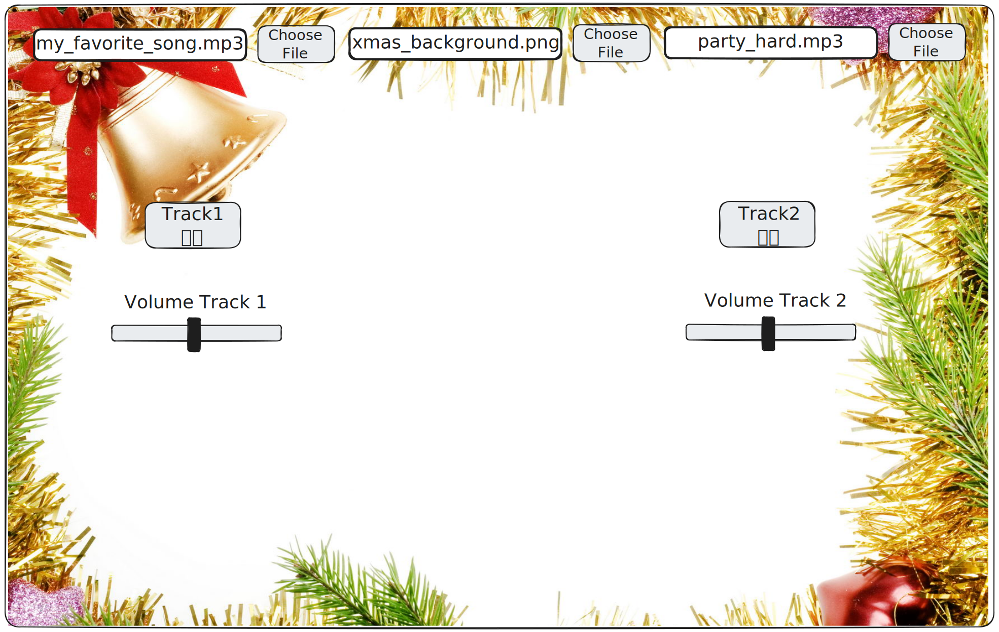

# Atelier : Améliorer votre Table de Mixage DJ

## Bienvenue !

Bienvenue dans la suite de l'atelier ! Vous avez déjà créé une table de mixage de base avec deux pistes, des boutons play/pause, et la possibilité de charger vos propres sons. Maintenant, nous allons l'améliorer pour en faire une vraie table de mixage professionnelle !

---

## Prérequis

Assurez-vous d'avoir terminé la Partie 0 :
- ✅ Chargement de sons et images
- ✅ Boutons play/pause
- ✅ Fonctions de gestion des clics

---

## Ce que vous allez construire

- **Sliders de volume** - Contrôler chaque piste indépendamment
- **Système de grille** - Positionnement professionnel et responsive
- **Upload d'images** - Changer le fond pendant l'exécution
- **Upload de sons** - Remplacer les pistes pendant l'exécution
- **Toggle play/pause** - Un seul bouton par piste
- **Labels et titre** - Interface claire

---

## Étape 1 : Ajouter des sliders de volume

### Étape 1A : Créer des variables pour les volumes

Ajoutez des variables `volume1` et `volume2` initialisées à `0.5` (50% de volume). Les volumes dans p5.js vont de 0.0 (silencieux) à 1.0 (volume maximum).

### **💪Exercice💪**:

Ajoutez les variables au début de votre code (après les variables `sound1`, `sound2`, `bg`).

**N.B.** : 0.5 représente 50% du volume.

### Étape 1B : Créer les sliders

Dans `setup()`, créez deux sliders avec une plage de 0 à 1, commençant à 0.5, avec un pas de 0.1. Les sliders permettent de contrôler le volume en temps réel.

**Documentation** : [`createSlider()`](https://p5js.org/reference/p5/createSlider) crée un élément slider.

### **💪Exercice💪**:

Créez `slider1` et `slider2` dans `setup()` avec `createSlider(0, 1, 0.5, 0.1)`.

### Étape 1C : Positionner les sliders

Positionnez les sliders en dessous des boutons play/pause de chaque piste. Cela organise visuellement les contrôles par piste.

### **💪Exercice💪**:

Utilisez `.position(x, y)` comme pour les boutons. Par exemple, si votre bouton play1 est à `(windowWidth/3 - 100, windowHeight/2 - 100)`, placez slider1 à `(windowWidth/3 - 100, windowHeight/2 + 20)`.

**Testez !** Vous devriez voir deux sliders que vous pouvez faire glisser !

### Étape 1D : Lire les valeurs des sliders

Dans `draw()`, lisez les valeurs des sliders avec `.value()` et stockez-les dans `volume1` et `volume2`. Les sliders retournent des valeurs de 0 à 1.

### **💪Exercice💪**:

Lisez les valeurs : `volume1 = slider1.value()` et `volume2 = slider2.value()`.

### Étape 1E : Appliquer le volume aux sons

Dans `draw()`, vérifiez si chaque son est en train de jouer, et si oui, appliquez le volume avec `.setVolume()`. Cela permet de contrôler le volume en temps réel pendant la lecture.

**Documentation** : [`.setVolume()`](https://p5js.org/reference/p5.SoundFile/setVolume/) définit le volume d'un son.

### **💪Exercice💪**:

Vérifiez `sound1.isPlaying()` et `sound2.isPlaying()`, puis appliquez les volumes avec `.setVolume(volume1)` et `.setVolume(volume2)`.

**Testez !** Lancez un son et déplacez le slider - le volume devrait changer en temps réel !

---

## Étape 2 : Un seul bouton play/pause au lieu de deux

### Étape 2A : Modifier les fonctions pour créer une bascule

Modifiez `onClickPlay1()` pour qu'elle fasse les deux actions : si le son joue, mettez en pause ; sinon, jouez le son. C'est ce qu'on appelle une "bascule" (toggle).

**Concept** : if/else

Vous pouvez exécuter du code si une condition est remplie (`if`) ou si elle ne l'est pas (`else`).

### **💪Exercice💪**:

Vérifiez `sound1.isPlaying()`. Si oui : `.pause()`. Si non : `.play()`, mais avant de jouer, définissez le volume avec `.setVolume(volume1)` et activez la boucle avec `.setLoop(true)`. Faites de même pour `onClickPlay2()`.

### Étape 2B : Remplacer les boutons

Dans `setup()`, remplacez les quatre boutons (play1, pause1, play2, pause2) par deux boutons avec le label "▶⏸" (ou "Play/Pause"). Cela simplifie l'interface.

### **💪Exercice💪**:

Créez deux boutons `play1` et `play2` avec le label "▶⏸". Connectez-les avec `play1.mousePressed(onClickPlay1)` et `play2.mousePressed(onClickPlay2)`.

**N.B.** : Vous pouvez supprimer les anciennes fonctions `onClickPause1` et `onClickPause2` car elles ne sont plus nécessaires.

**Testez !** Cliquez sur play1 - sound1 devrait jouer. Cliquez à nouveau - il devrait se mettre en pause !

---

## Étape 3 : Créer un système de grille pour le positionnement

### Étape 3A : Créer les fonctions de grille

Créez deux fonctions `gridX(cellX)` et `gridY(cellY)` qui convertissent des coordonnées de grille (0 à 5) en positions pixels. Cela facilite le positionnement et rend l'application responsive.

### **💪Exercice💪**:

Créez les fonctions au début de votre code (avant `preload()`). Pour une grille de 6 colonnes, la colonne 0 est à X = 0, la colonne 1 est à X = `width / 6`, etc. Même chose pour les lignes avec `height`.

**N.B.** : Dans `setup()`, utilisez `windowWidth` et `windowHeight` directement dans les calculs.

### Étape 3B : Repositionner les éléments avec la grille

Repositionnez tous vos éléments UI en utilisant le système de grille. Cela assure un positionnement cohérent et responsive.

### **💪Exercice💪**:

Repositionnez dans `setup()` :
- Bouton play1 : Colonne 1, Ligne 2 (utilisez `windowWidth / 6 * 1, windowHeight / 6 * 2`)
- Slider 1 : Colonne 1, Ligne 3
- Bouton play2 : Colonne 4, Ligne 2
- Slider 2 : Colonne 4, Ligne 3

---

## Étape 4 : Ajouter l'upload d'images de fond

### Étape 4A : Créer une variable pour l'image uploadée

Ajoutez une variable `bgImage` initialisée à `null`. Cette variable stockera l'image uploadée par l'utilisateur. Si elle est `null`, on utilisera l'image `bg` chargée dans `preload()`.

### **💪Exercice💪**:

Ajoutez la variable au début de votre code.

### Étape 4B : Créer le bouton d'upload

Dans `setup()`, créez un file input pour les images avec `createFileInput(handleBackgroundImage)`. Cela permet aux utilisateurs d'uploader leurs propres images pendant que l'application tourne.

**Documentation** : [`createFileInput()`](https://p5js.org/reference/p5/createFileInput) crée un bouton d'upload de fichier.

### **💪Exercice💪**:

Créez le file input dans `setup()`. Positionnez-le en haut du canvas (par exemple, colonne 1, ligne 0). Restreignez-le aux images avec `.attribute('accept', 'image/*')`.

### Étape 4C : Créer la fonction de gestion

Créez une fonction `handleBackgroundImage(file)` qui vérifie si le fichier est une image et le charge. p5.js appellera automatiquement cette fonction quand l'utilisateur sélectionne un fichier.

**Documentation** : [`loadImage()`](https://p5js.org/reference/p5/loadImage) charge les fichiers image.

### **💪Exercice💪**:

Vérifiez `file.type === 'image'`. Si oui, chargez l'image avec `loadImage(file.data)` et stockez-la dans `bgImage`.

### Étape 4D : Afficher l'image uploadée

Dans `draw()`, modifiez l'affichage du fond : si `bgImage` existe, affichez-la ; sinon, utilisez `background(bg)`. Cela permet d'afficher l'image uploadée ou l'image par défaut.

**Documentation** : [`image()`](https://p5js.org/reference/p5/image) dessine une image.

### **💪Exercice💪**:

Vérifiez si `bgImage` existe (n'est pas `null`). Si oui, affichez-la avec `image(bgImage, 0, 0, width, height)`. Sinon, utilisez `background(bg)`.

**Testez !** Cliquez sur le bouton d'upload et sélectionnez une image - elle devrait apparaître comme fond !

---

## Étape 5 : Ajouter l'upload de sons pour les pistes

### Étape 5A : Créer les fonctions de gestion

Créez deux fonctions `onUploadSound1(file)` et `onUploadSound2(file)` qui vérifient si le fichier est audio, arrêtent le son actuel, et chargent le nouveau son. Cela permet de remplacer les pistes pendant l'exécution.

**Documentation** : [`loadSound()`](https://p5js.org/reference/p5/loadSound/) charge les fichiers son.

### **💪Exercice💪**:

Vérifiez `file.type === 'audio'`. Si oui : arrêtez le son actuel avec `.stop()`, chargez le nouveau son avec `loadSound(file.data)`, définissez le volume avec `.setVolume(volume1)` (ou `volume2`), et activez la boucle avec `.setLoop(true)`.

### Étape 5B : Créer les boutons d'upload de sons

Dans `setup()`, créez deux file inputs pour les sons. Positionnez-les et restreignez-les aux fichiers audio. Cela permet aux utilisateurs d'uploader de nouveaux sons pour chaque piste.

### **💪Exercice💪**:

Créez les file inputs avec `createFileInput(onUploadSound1)` et `createFileInput(onUploadSound2)`. Positionnez-les (par exemple, colonne 1 ligne 1 pour piste 1, colonne 4 ligne 1 pour piste 2). Restreignez-les aux fichiers audio avec `.attribute('accept', 'audio/*')`.

**N.B.** : Comme pour les boutons, vous passez le nom de la fonction (sans les parenthèses) à `createFileInput()`. p5.js appellera automatiquement cette fonction quand l'utilisateur sélectionne un fichier.

**Testez !** Uploadez un nouveau son pour une piste - il devrait remplacer l'ancien !

---

## Étape 6 : Améliorer l'interface avec des labels

### Étape 6A : Ajouter un titre

Dans `draw()`, ajoutez un titre "DJ Mixing Deck" en haut du canvas, centré. Cela rend l'interface plus professionnelle.

**Documentation** : [`text()`](https://p5js.org/reference/p5/text/) dessine du texte.

### **💪Exercice💪**:

Utilisez `textAlign(CENTER)`, `textSize(min(width, height) * 0.04)` pour rendre le texte responsive, et `text("DJ Mixing Deck", width / 2, height / 12)`.

**N.B.** : `textSize(min(width, height) * 0.04)` rend le texte responsive - il s'adapte à la taille de l'écran.

### Étape 6B : Ajouter des labels pour les file inputs

Ajoutez du texte au-dessus de chaque file input pour expliquer ce qu'il fait. Cela clarifie l'interface.

### **💪Exercice💪**:

Ajoutez "Upload Background:" au-dessus du file input d'image, "Upload Track 1:" au-dessus du file input de son 1, et "Upload Track 2:" au-dessus du file input de son 2.

### Étape 6C : Ajouter des labels pour les sliders

Ajoutez le texte "Volume" au-dessus de chaque slider. Cela explique la fonction de chaque slider.

### **💪Exercice💪**:

Ajoutez le texte "Volume" au-dessus de chaque slider dans `draw()` avec `text()`.

**Testez !** Votre interface devrait maintenant être beaucoup plus claire avec tous les labels !

---

## Étape 7 : Tests

Testez chaque fonctionnalité :
- ✅ Cliquez sur play1 → sound1 joue
- ✅ Cliquez à nouveau sur play1 → sound1 se met en pause
- ✅ Cliquez sur play2 → sound2 joue
- ✅ Les deux pistes peuvent jouer en même temps (mixage !)
- ✅ Déplacez slider1 → le volume de sound1 change en temps réel
- ✅ Déplacez slider2 → le volume de sound2 change en temps réel
- ✅ Uploadez une image de fond → elle s'affiche comme fond
- ✅ Uploadez un son pour la piste 1 → il remplace le son par défaut
- ✅ Uploadez un son pour la piste 2 → il remplace le son par défaut

---

## Dépannage

**Le volume ne change pas ?**
- Vérifiez que vous lisez les valeurs des sliders dans `draw()`
- Vérifiez que vous appliquez le volume avec `.setVolume()` aux sons en lecture

**L'image ne s'affiche pas après l'upload ?**
- Vérifiez que vous utilisez `image()` dans `draw()` et que vous vérifiez si `bgImage` existe

**Le son ne joue pas après l'upload ?**
- Assurez-vous que vous appelez `loadSound(file.data)` et que vous définissez le volume et la boucle

**Les éléments ne s'adaptent pas au redimensionnement ?**
- Vérifiez que vous utilisez `windowWidth` et `windowHeight` dans `setup()` pour le positionnement initial
- Les éléments créés dans `setup()` ne se déplacent pas automatiquement - c'est normal ! Pour un vrai responsive, il faudrait recréer les éléments, mais c'est plus avancé.

**N.B.** : Vérifiez toujours la console (F12) pour les erreurs !

---

## Résultat final

Voici à quoi devrait ressembler votre table de mixage après avoir terminé cet atelier :

---

## Félicitations ! 🎉

Vous avez amélioré votre table de mixage DJ avec des fonctionnalités professionnelles !

**Ce que vous avez appris** :
- Comment créer et utiliser des sliders pour contrôler le volume
- Comment créer des fonctions de bascule (toggle)
- Comment utiliser un système de grille pour un positionnement responsive
- Comment gérer les uploads de fichiers (images et sons)
- Comment améliorer l'interface avec des labels et un titre
- Comment contrôler le volume en temps réel

Ces concepts vous aideront à construire des applications interactives encore plus complexes !

---
