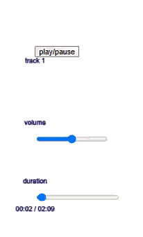
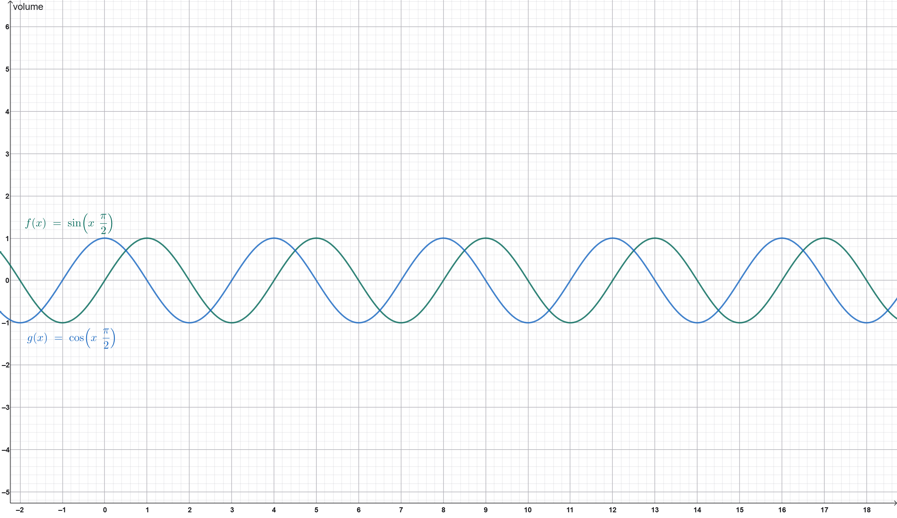
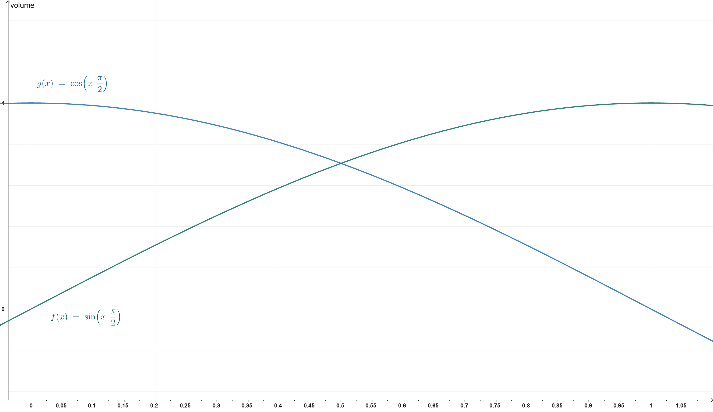

# Atelier : Table de Mixage DJ - Fonctionnalités Avancées

## Bienvenue !

Félicitations ! Vous allez maintenant ajouter des fonctionnalités avancées : sliders de temps, crossfader, et visualisation de l'amplitude.

---

## Prérequis

Assurez-vous d'avoir terminé la Partie 1 :
- ✅ Upload de fichiers (images et sons)
- ✅ Système de grille
- ✅ Sliders de volume
- ✅ Toggle play/pause

---

## Au programme

- **Sliders de temps** - Naviguer dans les pistes
- **Affichage du temps** - Format MM:SS
- **Crossfader** - Transitions douces avec trigonométrie
- **Visualisation de l'amplitude** - Cercles pulsants
- **Code organisé** - Fonctions réutilisables

---

## Étape 1 : Sliders de temps

### Étape 1A : Variables

Ajoutez des variables pour les sliders de temps (`timeSlider1`, `timeSlider2`) et pour savoir si l'utilisateur les fait glisser (`isDraggingTime1`, `isDraggingTime2`). Cela permet de stocker les éléments et éviter les conflits pendant le glissement.

### **💪Exercice💪**:

Ajoutez les variables en haut de votre code : `timeSlider1`, `timeSlider2`, `isDraggingTime1`, `isDraggingTime2`. Initialisez les sliders à `null` et les draggings à `false`.

### Étape 1B : Créer les sliders

Dans `setup()`, créez deux sliders (0-1) avec un pas de 0.1. Quand déplacé, calculez le temps correspondant et sautez avec `sound.jump()`. 0-1 représente le pourcentage de progression (0.0 = début, 1.0 = fin), et convertir en temps réel permet la navigation.

**Documentation** :
- [`sound.duration()`](https://p5js.org/reference/p5.SoundFile/duration)
- [`sound.jump()`](https://p5js.org/reference/p5.SoundFile/jump)
- [`sound.currentTime()`](https://p5js.org/reference/p5.SoundFile/currentTime)

### **💪Exercice💪**:

Créez les sliders dans `setup()` avec `createSlider(0, 1, 0, 0.1)`. Utilisez `.input()` pour détecter le déplacement : mettez `isDraggingTime1 = true`, calculez `targetTime = sliderValue * sound.duration()`, sautez avec `sound.jump(targetTime)`, puis remettez `isDraggingTime1 = false`.

### Étape 1C : Positionner

Positionnez les sliders sous les sliders de volume avec le système de grille. Cela assure une organisation visuelle claire.

### **💪Exercice💪**:

Positionnez avec `gridY(4)` pour sound1 et sound2.

### Étape 1D : Mettre à jour pendant la lecture

Dans `draw()`, mettez à jour les valeurs des sliders en fonction de la position actuelle. Le slider doit bouger automatiquement pour montrer la progression.

### **💪Exercice💪**:

Calculez la valeur : `sound.currentTime() / sound.duration()`. Mettez à jour le slider seulement si le son joue et si `isDraggingTime1` (ou `isDraggingTime2`) est `false`.

**Testez !** Le slider bouge pendant la lecture. Glissez-le pour sauter !

---

## Étape 2 : Affichage du temps (MM:SS)

### Étape 2A : Fonction de formatage

Créez `formatTime(seconds)` qui convertit en "MM:SS" avec toujours 2 chiffres. C'est plus lisible que les secondes brutes.

**Documentation** :
- [`String.padStart()`](https://developer.mozilla.org/en-US/docs/Web/JavaScript/Reference/Global_Objects/String/padStart)

### **💪Exercice💪**:

Calculez minutes : `Math.floor(seconds / 60)`. Calculez secondes : `Math.floor(seconds % 60)`. Utilisez `padStart(2, '0')` pour avoir 2 chiffres.

### Étape 2B : Afficher

Dans `draw()`, affichez "temps_écoulé / durée_totale" sous chaque slider de temps. Cela permet de voir rapidement la position et le temps restant.

### **💪Exercice💪**:

Utilisez `sound1.currentTime()` et `sound1.duration()`, formatez avec `formatTime()`, combinez avec " / ".

**Testez !** Vous devriez voir "00:15 / 03:42" !

---

## Étape 3 : Crossfader

### Étape 3A : Variables

Ajoutez `crossfader` (slider) et `crossfaderValue` (valeur, initialisée à 50). Cela permet de stocker l'élément et sa valeur, et 50% signifie que les deux pistes sont entendues également.

### **💪Exercice💪**:

Ajoutez les variables en haut du code.

### Étape 3B : Créer le slider

Créez un slider 0-100, valeur initiale 50, pas de 0.1, positionné au centre. Cela le rend accessible et équilibré visuellement.

### **💪Exercice💪**:

Créez le slider dans `setup()` avec `createSlider(0, 100, 50, 0.1)`. Positionnez au centre avec `width/2` et `height * 0.9`.

### Étape 3C : Logique avec trigonométrie

Dans `draw()`, convertissez la valeur (0-100) en angle (0 à π/2). Utilisez `cos(angle)` pour sound1 et `sin(angle)` pour sound2, puis multipliez par le volume individuel. `cos()` et `sin()` créent des transitions douces, et multiplier par le volume respecte les réglages individuels.

**Documentation** :
- [`cos()`](https://p5js.org/reference/p5/cos)
- [`sin()`](https://p5js.org/reference/p5/sin)

### **💪Exercice💪**:

Créez `applyCrossfader()`. Angle = `(crossfaderValue / 100) * (PI / 2)`. Volume sound1 = `cos(angle) * volume1`. Volume sound2 = `sin(angle) * volume2`. Appelez dans `draw()`.

**Testez !** Déplacez le crossfader - transition douce entre les pistes !

---

## Étape 4 : Visualisation de l'amplitude

### Étape 4A : Analyseurs d'amplitude

Dans `setup()`, créez `amp1` et `amp2` (p5.Amplitude). Connectez avec `amp.setInput(sound)`. Pour les uploads, utilisez `setTimeout(100ms)` avant de connecter. Cela mesure l'amplitude audio, et le délai permet au son de s'initialiser.

**Documentation** :
- [`p5.Amplitude`](https://p5js.org/reference/p5.Amplitude)
- [`setTimeout()`](https://developer.mozilla.org/fr/docs/Web/API/setTimeout)

### **💪Exercice💪**:

Créez les analyseurs dans `setup()` et connectez aux sons existants. Dans `onUploadSound1()` et `onUploadSound2()`, utilisez `setTimeout()` pour connecter après 100ms.

### Étape 4B : Variables de taille

Ajoutez `pulseSize1` et `pulseSize2` (initialisées à 80). Cela permet de stocker la taille actuelle des cercles qui changent avec l'amplitude.

### **💪Exercice💪**:

Ajoutez les variables en haut du code.

### Étape 4C : Dessiner la visualisation

Dans `draw()`, créez `drawAmplitudeVisualization()`. Obtenez l'amplitude avec `amp.getLevel()`, calculez la taille, dessinez les cercles au centre. Cela rend l'interface vivante et montre le rythme visuellement.

**N.B.** : L'amplitude fonctionne même si volume = 0% car elle lit l'audio brut.

### **💪Exercice💪**:

Calculez taille : `80 + (amp.getLevel() * 400)`. Dessinez les cercles au centre avec `circle()`. Appelez dans `draw()`.

**Testez !** Les cercles pulsent avec le rythme !

---

## Étape 5 : Labels et mise en page

### Étape 5A : Labels de durée

Ajoutez "duration" au-dessus de chaque slider de temps. Cela clarifie la fonction du slider.

### **💪Exercice💪**:

Ajoutez le texte dans `draw()` avec `text()`.

### Étape 5B : Label crossfader

Ajoutez "crossfader" au-dessus du slider. Cela explique la fonction.

### **💪Exercice💪**:

Ajoutez le label dans `draw()`.

### Étape 5C : Mise en page

Organisez tous les éléments selon la mise en page. Cela crée une interface claire et professionnelle.

### **💪Exercice💪**:

Positionnez dans `setup()` :
- File inputs : ligne 1
- Boutons play/pause : ligne 2
- Visualisation amplitude : centre, ligne 2-3
- Sliders volume : ligne 3
- Sliders temps : ligne 4
- Crossfader : ligne 5

---

## Étape 6 : Organisation du code

Organisez en petites fonctions :
- Setup : création des éléments
- Draw : affichage et mise à jour
- Helpers : fonctions réutilisables

**Pourquoi** : Code plus facile à comprendre et maintenir.

---

## Étape 7 : Tests

Testez :
- ✅ Sliders de temps : bougent et permettent de sauter
- ✅ Affichage temps : format MM:SS correct
- ✅ Crossfader : transitions douces
- ✅ Visualisation amplitude : cercles pulsent
- ✅ Code organisé

---

## Félicitations ! 🎉

Vous avez ajouté des fonctionnalités DJ avancées !

**Ce que vous avez appris** :
- Navigation dans l'audio avec sliders de temps
- Formatage du temps
- Trigonométrie pour crossfade doux
- Analyse d'amplitude audio
- Organisation du code

---

## Dépannage

**Slider de temps ne se met pas à jour** : Vérifiez la mise à jour dans `draw()`

**Impossible de sauter** : Vérifiez `sound.jump(targetTime)` dans `.input()`

**Crossfader pas doux** : Vérifiez l'utilisation de `cos()` et `sin()`

**Visualisation ne s'affiche pas** : Vérifiez `amp.setInput(sound)` et l'appel dans `draw()`

**Cercles ne pulsent pas** : Vérifiez `amp.getLevel()` et le calcul de taille

**N.B.** : Vérifiez toujours la console (F12) pour les erreurs !

